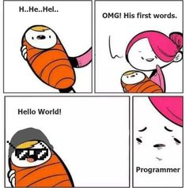

Internship - Web Concepts
=========================

This is a repository for you to play around with small projects for the purpose of learning the concepts of the web.

This small course is structured in 4 parts, corresponding to the folders in the application

Prerequisites:
1. Run **npm install** in the root folder
2. In each of the exercise files you will find in the comments a requirement and maybe some helpful links.
3. To run the files, run the command **node exercise-file.js**
4. If there is a *server.js* file to run use **npm run**

Do the exercises in order & have fun.

